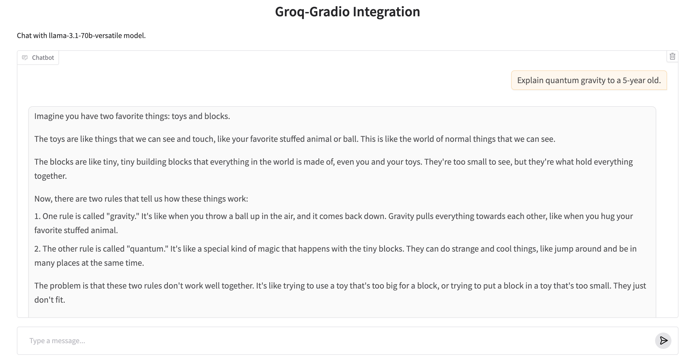

# `groq-gradio`

`groq-gradio` is a Python package that simplifies the creation of machine learning applications powered by [Groq](https://groq.com/) for lightning-fast 
inference speed and low latency using easily deployable [Gradio](https://www.gradio.app/) interfaces.

## Features
- **Fast Inference Speed:** Seamless integration with Groq API to leverage fast inference for your AI apps 🚀
- **Rapid Development:** Functional frontend creation with a few lines of code (that can be easily deployed to [HF Spaces](https://huggingface.co/docs/hub/en/spaces-overview)) 🤩
- **Flexible UI Options:** Ability to launch a responsive web interface with customizable titles, descriptions, and example prompts 🎨
- **Multi-Modal Model Support:** Ability to build interfaces for any LLM powered by Groq via your [Groq API Key](https://console.groq.com/keys) 💪


# Installation

Install `groq-gradio` using `pip`:

```bash
pip install groq-gradio
``` 

# Quick Start
## 1. Set up your Groq API Key
First, if you haven't already, create a free account on [GroqCloud](https://console.groq.com/) and generate a [Groq API Key](https://console.groq.com/keys). Set your Groq API Key as an environment variable:

```bash
export GROQ_API_KEY=<YOUR_GROQ_API_KEY>
```

## 2. Create a basic Gradio chat interface
Create a Python file, paste the following example code, and run the file:

```python
import gradio as gr
import groq_gradio

gr.load(
    name='llama-3.2-3b-preview',
    src=groq_gradio.registry,
).launch()
```

As shown below, this will launch a simple Gradio chat interface for the [`llama-3.2-3b-preview`](https://console.groq.com/docs/models#llama-32-3b-preview) model powered by Groq!


# Customization 
## Custom Interface Example

Once you create a Gradio UI from a Groq API endpoint, you can customize it by setting your own input and output components, or any other arguments to `gr.Interface` as shown in the example below.




The example screenshot above was generated with the following few lines of code:

```py
import gradio as gr # The Gradio library for creating web interfaces
import groq_gradio # Our package that seamlessly connects Gradio with Groq API

# Gradio function that loads a pre-configured interface:
gr.load(
    name='llama-3.2-3b-preview', # The specific model powered by Groq to use
    src=groq_gradio.registry, # Tells Gradio to use our custom interface registry as the source
    # Optional customization parameters:
    title='Groq-Gradio Integration', # The title shown at the top of our UI
    description="Chat with the Llama 3.2 3B Preview model powered by Groq.", # Subtitle
    examples=["Explain quantum gravity to a 5-year old.", "How many R are there in the word Strawberry?"] # Pre-written prompts users can click to try
).launch() # Creates and starts the web server!
```

## Composition

You can also create multiple interfaces for multiple models using Gradio Blocks:
```python
import gradio as gr
import groq_gradio

with gr.Blocks() as demo:
    with gr.Tab("Llama 3.2 3B Preview"):
        gr.load('llama-3.2-3b-preview', src=groq_gradio.registry)
    with gr.Tab("llama-3.2-1b-preview"):
        gr.load('llama-3.2-1b-preview', src=groq_gradio.registry)

demo.launch()
```

# Technical Details

The `groq-gradio` Python library has two dependencies: `groq` and `gradio`. It defines a "registry" function `groq_gradio.registry`, which takes in a model name and returns a Gradio app.

All models supported by Groq are compatible with this integration. For a comprehensive list of available models and their specifications, please refer to the [Groq Models documentation](https://console.groq.com/docs/models).

# Troubleshooting
If you encounter a 401 authentication error, then the Groq API Client is not able to fetch your Groq API Key from your environment variable. In this case, set the key directly in your Python session:

```py
import os

os.environ["GROQ_API_KEY"] = ...
```

**Note:** Please make sure to **never** share your Groq API Key publicly. If you are planning on making your app available publicly, remove
your Groq API Key before publishing!

# Contributing
Contributions are always welcome! Please feel free to submit a Pull Request that our team can review.
